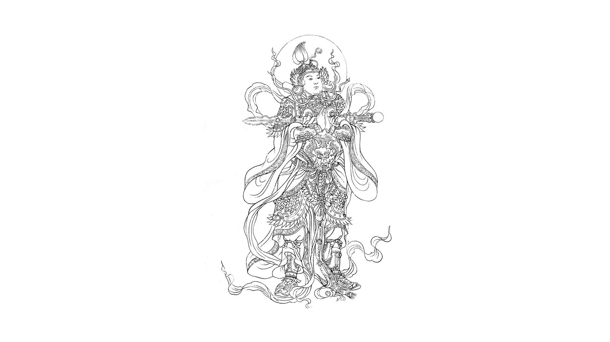

#

## Chú
* [Lăng Nghiêm - Đại Bi - Thập Chú](chu.md)
* [Chú Lăng Nghiêm ](./chu/Chu-Lang-Nghiem.md)
* [Chú Đại Bi](./chu/Chu-Dai-Bi.md)

## Kinh Điển
- [Kinh Kim Cang (kinh văn)](./kinh/Kinh-Kim-Cang.md)
- [Kinh Thủ Lăng Nghiêm, bản của Linh Sơn Pháp Bảo Đại Tạng Kinh, Tâm Minh Lê Đình Thám dịch ](./kinh/Kinh-Thu-Lang-Nghiem.md)

